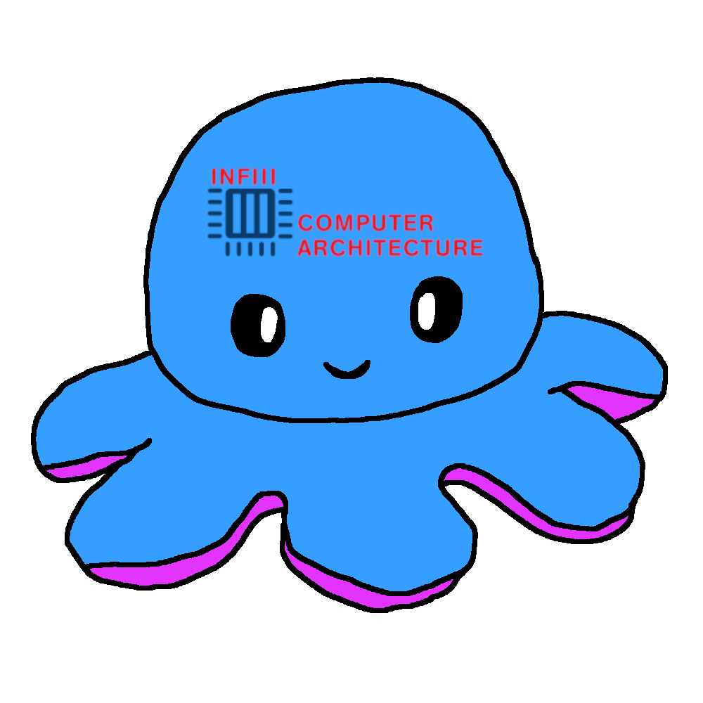

# DatenGRAke



Multithreaded, dependency-less Java server which logs time-based telemetry data, mainly used for evaluating assembly excercises. Users are identified using their 8-character IdM ID. By default listening on TCP Port `7181`.

## Building

Requires a JDK

```bash
git clone https://github.com/Jojodicus/DatenGRAke
cd DatenGRAke
chmod +x build.sh
./build.sh
```

## Running

Requires a JRE

```bash
java -jar DatenGRAke.jar
```

## Data format

Before exchanging data, the client sends the server an AES key which is encrypted with the servers' RSA public key (the pair has to be generated and distributed beforehand). For this, the client generates a key, then sends a 16 byte short indicating the length of the key. After that, the key is sent. An example Client can be seen [here](example-client/).

The data format is rather simple:

`<IdM><file-contents>`

Example:

`xy12abcd# Hello World`

Sent at June 22th, 2023 will create the following file:

**telemetry-data/xy12abcd/1687449125.asm**:
```
# Hello World
```

The "telemetry-data" folder can optionally be changed by providing a commandline-argument.

Instead of the IdM, one can also provide the phrase `crashing`, which will also be recognized as valid. This will then sort all faulty programs into a seperate folder.
